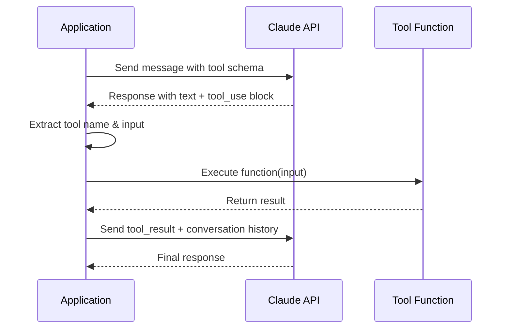
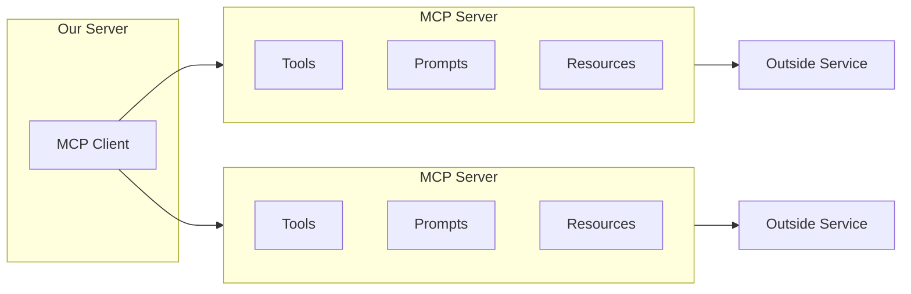
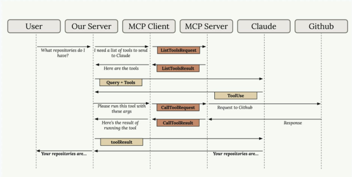

### Setup

- Install uv
- Initilize the project `uv init`
- Add dependencies with `uv add <package-name>` command. For example: `uv add anthropic`
- Run the programs with `uv run file-name`
- Set Python Interpreter in VScode to `uv`

### Notes

SDK https://platform.claude.com/docs/en/agent-sdk/overview

### Claude API

#### Messages API

https://platform.claude.com/docs/en/build-with-claude/working-with-messages

The core of making API requests is the **client.messages.create()** function. This function requires three key parameters:

- model - The name of the Claude model you want to use
- max_tokens - A safety limit on response length (not a target)
- messages - The conversation history you're sending to Claude

##### Understanding messages

- User messages - Content you want to send to Claude (written by humans)
- Assistant messages - Responses that Claude has generated

###### Stateless conversation

Claude does not remember previous messages in a conversation. Each message is treated as a new conversation.

Multi-Turn conversations:

- Add the assistant message to the user message and convert it to to a loop conversation

#### System Prompts

Assign a persona to the LLM model by adding a system prompt at the start of the messages array.
System

#### Temperature

- Temperature is a powerful parameter that controls how predictable or creative Claude's responses will be. Understanding how to use it effectively can dramatically improve the AI applications.
- Temperature is a decimal value between 0 and 1 that directly influences these selection probabilities. It's like adjusting the "creativity dial" on Claude's responses.

Tokenization - Breaking the input into smaller chunks
Prediction - Calculating probabilities for possible next words
Sampling - Choosing a token based on those probabilities

At low temperatures (near 0), Claude becomes very deterministic - it almost always picks the highest probability token. At high temperatures (near 1), Claude distributes probability more evenly across options, leading to more varied and creative outputs.

```
# Low temperature - more predictable
answer = chat(messages, temperature=0.0)

# High temperature - more creative
answer = chat(messages, temperature=1.0)
```

#### Response Streaming

With streaming enabled, Claude immediately sends back an initial response indicating it has received the request and is starting to generate text. Then you receive a series of events, each containing a small piece of the overall response.

##### Stream Events

Claude sends back several types of events:

- MessageStart - A new message is being sent
- ContentBlockStart - Start of a new block containing text, tool use, or other content
- ContentBlockDelta - Chunks of the actual generated text
- ContentBlockStop - The current content block has been completed
- MessageDelta - The current message is complete
- MessageStop - End of information about the current message

The **ContentBlockDelta** events contain the actual generated text to display to users.

```
with client.messages.stream(
    model=model,
    max_tokens=1000,
    messages=messages
) as stream:
    for text in stream.text_stream:
        # Send each chunk to client
        pass

    # Get the complete message for database storage
    final_message = stream.get_final_message()
```

#### Controlling Model output

- Prefilled Assistant Messages (The key thing to understand is that \
  Claude continues from exactly where prefilled text ends.)
- Stop sequences

```
messages = []
add_user_message(messages, "Count from 1 to 10")
answer = chat(messages, stop_sequences=["5"])
```

#### Structured data

````
messages = []

add_user_message(messages, "Generate a very short event bridge rule as json")
add_assistant_message(messages, "```json")

text = chat(messages, stop_sequences=["```"])
````

This will work for other formats Also

- Python code snippets
- Bulleted lists
- CSV data
- Any formatted content where you want just the content, not explanations

Also, in beta:

> https://platform.claude.com/docs/en/build-with-claude/structured-outputs

### Prompting

## Tool Use with Claude

#### How Tool Use Works

- Initial Request: You send Claude a question along with instructions on how to get extra data from external sources
- Tool Request: Claude analyzes the question and decides it needs additional information, then asks for specific details about what data it needs
- Data Retrieval: The server runs code to fetch the requested information from external APIs or databases
- Final Response: You send the retrieved data back to Claude, which then generates a complete response using both the original question and the fresh data

#### Benefits of Tool Use

- Real-time Information: Access current data that wasn't available during Claude's training
- External System Integration: Connect Claude to databases, APIs, and other services
- Dynamic Responses: Provide answers based on the latest available information
- Structured Interaction: Claude knows exactly what information it needs and how to ask for it

Tool use transforms Claude from a static knowledge base into a dynamic assistant that can work with live data.

#### Best Practices for Tool Functions

- Use descriptive names: Both the function name and parameter names should clearly indicate their purpose
- Validate inputs: Check that required parameters aren't empty or invalid, and raise errors when they are
- Provide meaningful error messages: Claude can see error messages and might retry the function call with corrected parameters

#### Generate Tool Function Schema

Creating a JSON schema that tells Claude what arguments the function expects and how to use it. This schema acts as documentation that Claude reads to understand when and how to call the tools.

#### Adding Type Safety

For better type checking, import and use the ToolParam type from the Anthropic library:

```
from anthropic.types import ToolParam

get_current_datetime_schema = ToolParam({
    "name": "get_current_datetime",
    "description": "Returns the current date and time formatted according to the specified format",
    # ... rest of schema
})
```

#### Multi-block Messages

A multi-block message typically contains:

- Text Block - Human-readable text explaining what Claude is doing (like "I can help you find out the current time. Let me find that information for you")
- ToolUse Block - Instructions for the code about which tool to call and what parameters to use

The tool usage process follows this pattern:

- Send user message with tool schema to Claude
- Receive assistant message with text block and tool use block
- Extract tool information and execute the actual function
- Send tool result back to Claude along with complete conversation history
- Receive final response from Claude

#### ToolResult Block

The tool result block has several important properties:

tool_use_id - Must match the id of the ToolUse block that this ToolResult corresponds to
content - Output from running the tool, serialized as a string
is_error - True if an error occurred



example:

```
Message(id='msg_01Tya325steqAYpHGNgtLvmw', \
content=[ToolUseBlock(id='toolu_01Nqud42Ha4ETCH7wVCk86F5', \
input={'datetime_str': '2050-01-01', 'duration': 177, 'unit': 'days'},
name='add_duration_to_datetime', type='tool_use')],
model='claude-haiku-4-5-20251001', role='assistant', \
stop_reason='tool_use', stop_sequence=None, type='message', \
usage=Usage(cache_creation=CacheCreation(ephemeral_1h_input_tokens=0, ephemeral_5m_input_tokens=0), cache_creation_input_tokens=0, cache_read_input_tokens=0, input_tokens=1553, output_tokens=99, server_tool_use=None, service_tier='standard'))
```

The complete multi-turn conversation works like this:

- Send user message to Claude with available tools
- Claude responds with text and/or tool requests
- Execute all requested tools and create result blocks
- Send tool results back as a user message
- Repeat until Claude provides a final answer

## Agents and Workflows

Workflows and agents are strategies for handling user tasks that can't be completed by Claude in a single request. You've actually been creating both throughout this course - when you used tools and let Claude figure out how to complete tasks, that was an agent.

Use workflows when you can picture the exact flow or steps that Claude should go through to solve a problem, or when the app's UX constrains users to a set of tasks
Use agents when you're not sure exactly what task or task parameters you'll give to Claude
Workflows are a series of calls to Claude meant to solve a specific problem through a predetermined series of steps. Agents give Claude a goal and a set of tools, expecting Claude to figure out how to complete the goal through the provided tools.

- Parallelization workflows (task parallelization, tool parallelization)
- Chaining workflows (step-by-step workflows, tree-of-thoughts workflows)
- Routing workflows (category-based routing, keyword-based routing, model-based routing)

## MCP

Model Context Protocol (MCP) is a communication layer that provides Claude with context and tools without requiring you to write a bunch of tedious integration code. Think of it as a way to shift the burden of tool definitions and execution away from the server to specialized MCP servers.

### MCP Architecture





#### MCP inspector

Development Workflow

The inspector creates an efficient development loop:

- Make changes to the MCP server code
- Test individual tools through the inspector
- Verify results without needing a full application setup
- Debug issues in isolation

This tool becomes essential as you build more complex MCP servers. It eliminates the need to wire up the server to Claude or another application just to test basic functionality, making development much faster and more focused.

#### MCP Client

The MCP client consists of two main components:

- MCP Client - A custom class we create to make using the session easier
- Client Session - The actual connection to the server (part of the MCP Python SDK)

#### Resources

- Direct Resources: Static URIs that don't change, like docs://documents
- Templated Resources: URIs with parameters, like docs://documents/{doc_id}

#### Prompts

Prompts in MCP define a set of user and assistant messages that can be used by the client. These prompts should be high quality, well-tested, and relevant to the overall purpose of the MCP server.

## Agents and tools

Claude Code has access to generic, flexible tools like:

- bash - Run any command
- read - Read any file
- write - Create any file
- edit - Modify files
- glob - Find files
- grep - Search file contents

## System Prompts for Environment Inspection

When designing own agents, always ask: "How will Claude know if this action worked?" Whether you're working with files, APIs, or user interfaces, provide tools and instructions that let Claude observe the results of its actions.

This might mean:

- Reading file contents before modifications
- Taking screenshots after UI interactions
- Checking API responses for expected data
- Validating generated content against requirements

Environment inspection transforms Claude from a blind executor of commands into an agent that can truly understand and adapt to its working environment.

```

```
