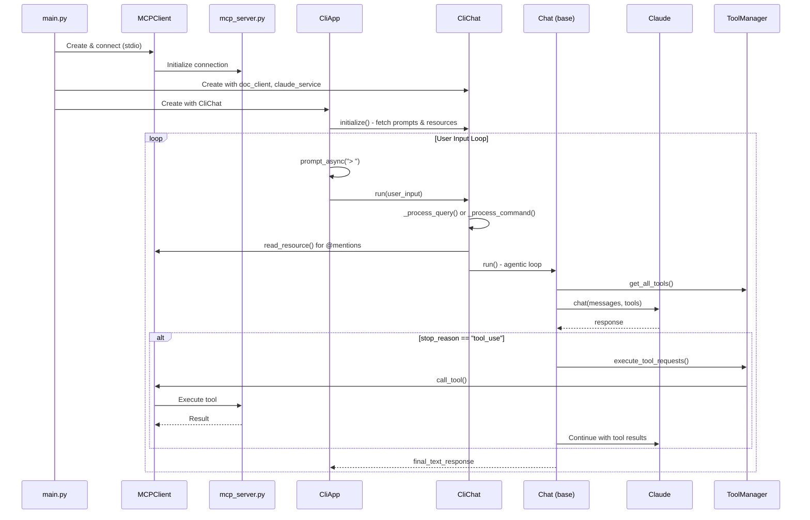
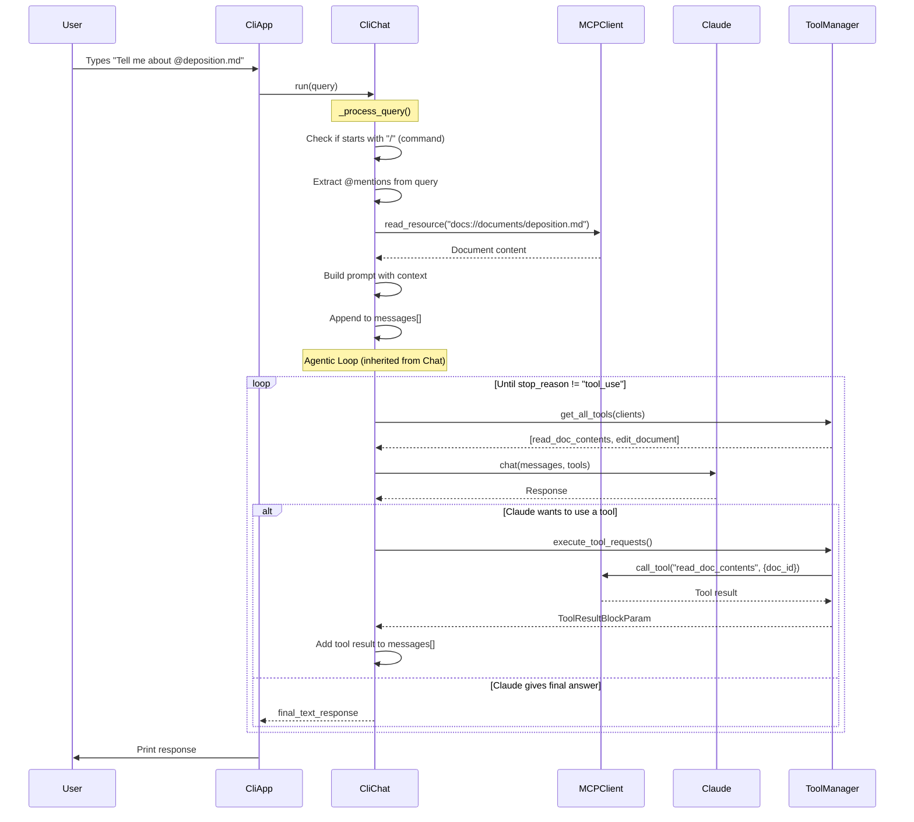

# MCP Chat - Program Flow Documentation

## Program Startup and Flow

### Sequence Diagram

### Key Touchpoints

| Step | File | What Happens |
|------|------|--------------|
| **1. Startup** | `main.py#L26-L59` | Creates `Claude` service, spawns `MCPClient` → `mcp_server.py` via stdio |
| **2. CLI Init** | `core/cli.py#L179-L181` | `CliApp.initialize()` fetches prompts & resources for autocomplete |
| **3. Input Loop** | `core/cli.py#L199-L210` | `prompt_async()` waits for user input, calls `agent.run()` |
| **4. Query Processing** | `core/cli_chat.py#L51-L89` | Handles `/commands` (prompts) or `@mentions` (resources) |
| **5. Agentic Loop** | `core/chat.py#L16-L46` | Loops calling Claude → if `tool_use`, executes tools via `ToolManager` → continues until final response |
| **6. Tool Execution** | `core/tools.py#L53-L106` | Finds correct client, calls MCP tool, returns result to Claude |

---

## What Happens When a Question is Asked

### Sequence Diagram

### Step-by-Step Breakdown

| Step | Location | What Happens |
|------|----------|--------------|
| **1. Input captured** | `core/cli.py#L202` | `prompt_async("> ")` captures user input |
| **2. Run called** | `core/cli.py#L206` | Calls `agent.run(user_input)` |
| **3. Process query** | `core/cli_chat.py#L65-L89` | Extracts `@mentions`, fetches doc content via MCP resource, builds prompt with `<context>` |
| **4. Get tools** | `core/chat.py#L27` | `ToolManager.get_all_tools()` collects tools from all MCP clients |
| **5. Call Claude** | `core/chat.py#L25-L28` | Sends messages + tools to Anthropic API |
| **6. Tool loop** | `core/chat.py#L32-L40` | If Claude returns `stop_reason="tool_use"`, executes tools via MCP, adds results, loops back |
| **7. Final response** | `core/chat.py#L42-L44` | When Claude is done, extracts text and returns |

### Key Insight

**Resources** (`@mentions`) are fetched *before* calling Claude and injected into the prompt, while **tools** are available for Claude to call *during* the conversation loop.
